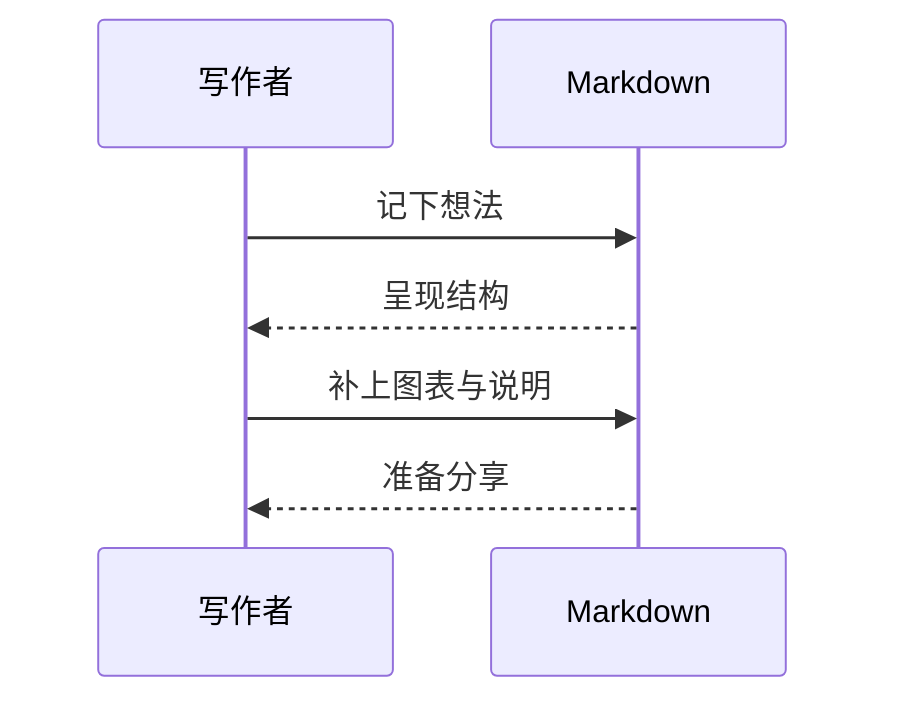
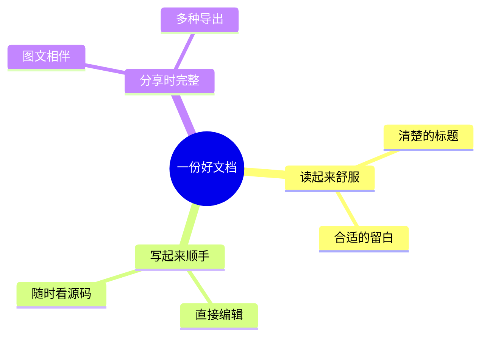
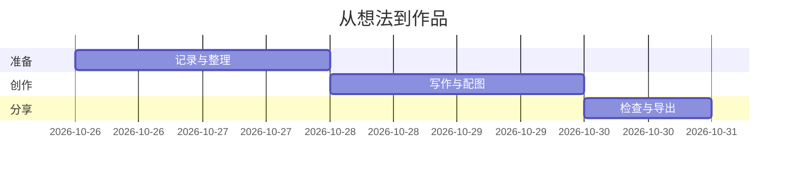

# 图表画廊

**用不同的图，讲不同的事。**

## 对话与协作

```mermaid
sequenceDiagram
    participant 我 as 写作者
    participant 文档 as Markdown
    我->>文档: 记下想法
    文档-->>我: 呈现结构
    我->>文档: 补上图表与说明
    文档-->>我: 准备分享
```

## 围绕一个想法

```mermaid
mindmap
  root((一份好文档))
    读起来舒服
      清楚的标题
      合适的留白
    写起来顺手
      直接编辑
      随时看源码
    分享时完整
      图文相伴
      多种导出
```

## 一周的创作节奏

```mermaid
gantt
    title 从想法到作品
    dateFormat YYYY-MM-DD
    section 准备
    记录与整理 :a, 2026-10-26, 2d
    section 创作
    写作与配图 :b, after a, 2d
    section 分享
    检查与导出 :c, after b, 1d
```
